# Coders Blog 👩‍💻

 

  

  

  

  

  

  

 

  

  

  

  

 

  

  

  

  

  

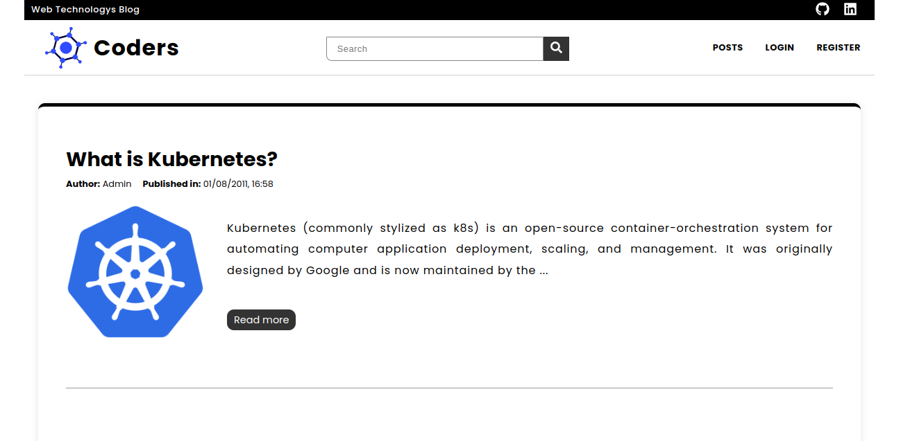

 

## ➡️ Project Description

This project involves developing a Node.js API using the Sequelize package to perform CRUD operations on blog posts. The application also includes implementing user authentication and associating users, posts, and categories.

Deploy: [Coders Blog!](https://deploy-bloggs.vercel.app/)

 

## ➡️ Features

### ▶️ RESTful Endpoints:

Implementation of endpoints to perform CRUD operations on posts.

### ▶️ User Authentication:

Creation of posts requires user authentication.

### ▶️ User-Post Relationship:

Establishment of a relationship between users and posts, ensuring each post is associated with a specific user.

### ▶️ Post-Category Relationship:

Use of categories to classify posts, establishing a relationship between posts and categories. Each post can belong to one or more categories.

 

## ➡️ Project Setup

### ▶️ Dependency Installation:

1. npm run install:apps to install necessary dependencies.
2. npm run compose:up to start the backend container and database.
3. npm run dev to start the frontend

### ▶️ Database Configuration:

- Configure the database connection information in the config/database.js file.

 

## ➡️ Endpoints

### ▶️ User

- POST /user - Create a new user
- GET /user - Get all users
- GET /user/:id - Get user by ID
- PUT /user/:id - Update user
- DELETE /user:id - Delete user

### ▶️ Post

- POST /post: Creates a new post (requires authentication).
- GET /post: Retrieves the list of all posts. (requires authentication)
- GET /post/:id: Retrieves details of a specific post. (requires authentication)
- GET /post/search: search for a post using a string
- PUT /post/:id: Updates an existing post (requires authentication).
- DELETE /post/:id: Deletes an existing post (requires authentication).

### ▶️ Categories

- POST /categories - Create a new category
- GET /categories - Get all categories
- PUT /categories/:id - Update category
- DELETE /categories/:id - Delete category 

### ▶️ Authentication

- POST /login: Performs user login.
- GET /login/role: Get the user role

 

## ➡️ ScreenShots

### ▶️ Home Page

 

### ▶️ Login Page

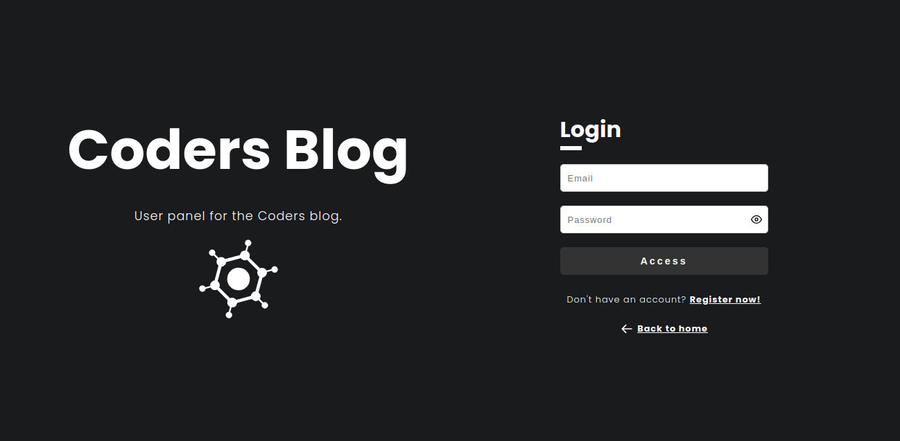

 

### ▶️ Register Page

 

### ▶️ Dashboard Page

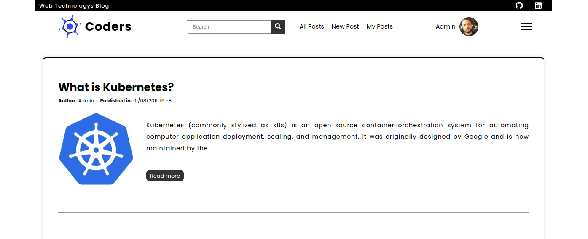

 

### ▶️ Single Post Page

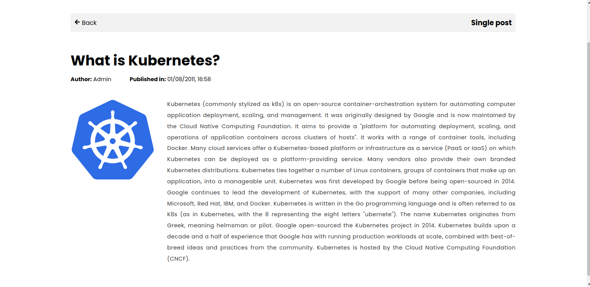

 

### ▶️ Create Post Page

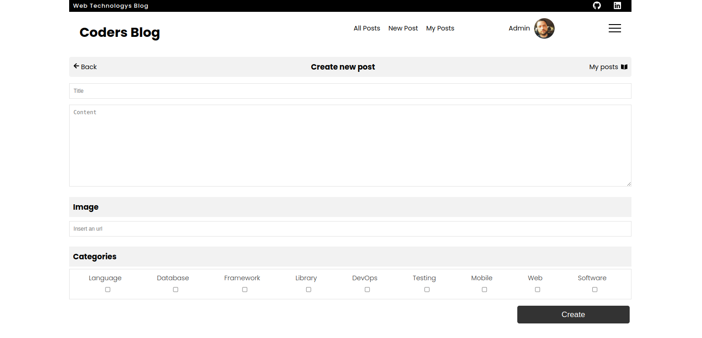

 

### ▶️ Edit Post Page

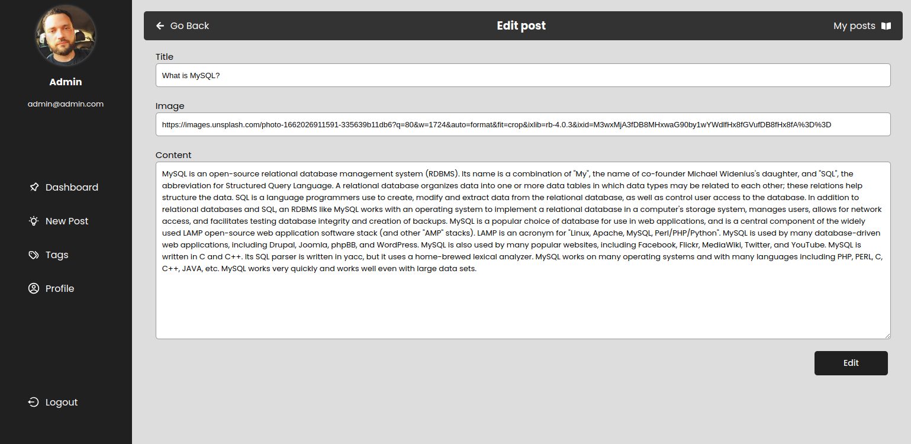

 

### ▶️ User Posts Page

 

### ▶️ Profile Page

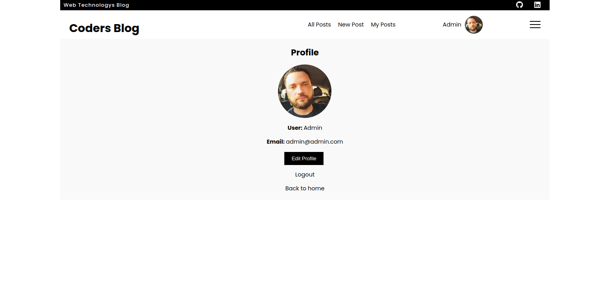

 

## ➡️ ScreenShots - Version Mobile

 

### ▶️ Home Page

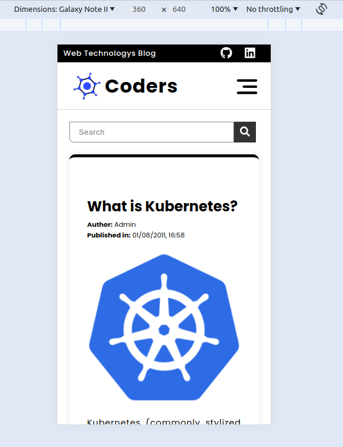

 

### ▶️ Login Page

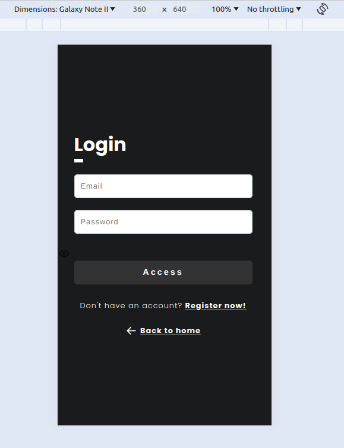

 

### ▶️ Register Page

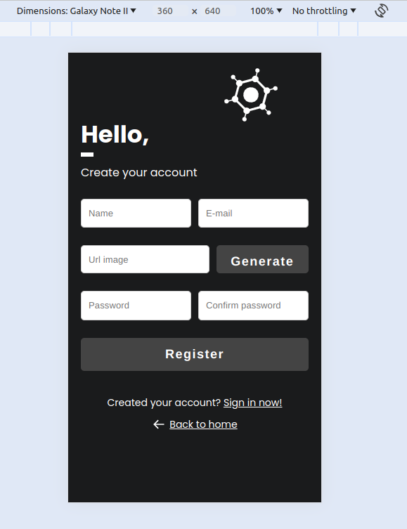

 

### ▶️ Dashboard Page

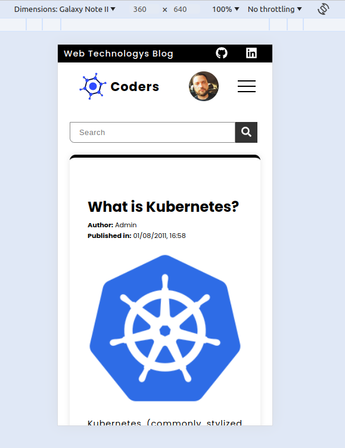

